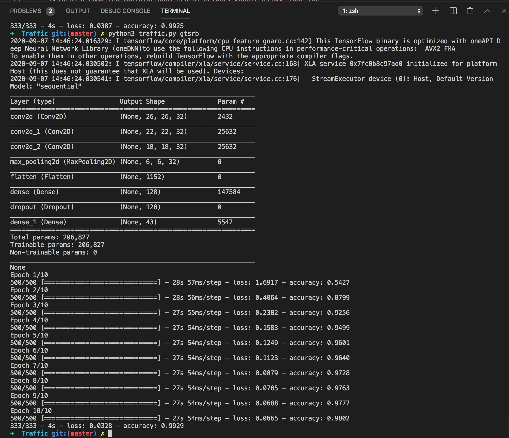
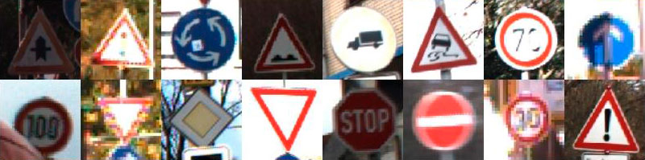

# Traffic

## An AI to identify which traffic sign appears in a photograph

As research continues in the development of self-driving cars, one of the key challenges is computer vision, allowing these cars to develop an understanding of their environment from digital images. In particular, this involves the ability to recognize and distinguish road signs – stop signs, speed limit signs, yield signs, and more.

This project uses TensorFlow to build a neural network to classify road signs based on an image of those signs. To do so, it needs a labeled dataset: a collection of images that have already been categorized by the road sign represented in them.

Several such data sets exist, this project uses the German Traffic Sign Recognition Benchmark (GTSRB) data set, which contains thousands of images of 43 different kinds of road signs.

## Implementation

The `gtsrb` directory contains 43 subdirectories numbered `0` through `42`. Each numbered subdirectory represents a different category (a different type of road sign). Within each traffic sign’s directory is a collection of images of that type of traffic sign.

In `traffic.py` the `main` function accepts as command-line arguments a directory containing the data and (optionally) a filename to which to save the trained model. The data and corresponding labels are then loaded from the data directory (via the `load_data` function) and split into training and testing sets. After that, the `get_model` function is called to obtain a compiled neural network that is then fitted on the training data. The model is then evaluated on the testing data. Finally, if a model filename was provided, the trained model is saved to disk.

### Loading the data

* The `load_data` function accepts as an argument `data_dir`, representing the path to a directory where the data is stored, and return image arrays and labels for each image in the data set.

* We may assume that `data_dir` will contain one directory named after each category, numbered `0` through `NUM_CATEGORIES` - 1. Inside each category directory will be some number of image files.

* The OpenCV-Python module (`cv2`) is used to read each image as a `numpy.ndarray` (a numpy multidimensional array). To pass these images into a neural network, the images need to be the same size, so each image is being resized to have width `IMG_WIDTH` and height `IMG_HEIGHT`.

* The function return a tuple `(images, labels)`. `images` is a list of all the images in the data set, where each image is represented as a `numpy.ndarray` of the appropriate size. `labels` is a list of integers, representing the category number for each of the corresponding images in the `images` list.

* On macOS, the `/` character is used to separate path components, while the `\` character is used on Windows. By using `os.path.join`, this function is platform-independent, it works regardless of operating system.

### Defining the model

* The `get_model` function return a compiled neural network model.

* We may assume that the input to the neural network will be of the shape `(IMG_WIDTH, IMG_HEIGHT, 3)` (that is, an array representing an image of width `IMG_WIDTH`, height `IMG_HEIGHT`, and `3` values for each pixel for red, green, and blue).

* The output layer of the neural network have `NUM_CATEGORIES` units, one for each of the traffic sign categories.

* The number of layers and the types of layers included in between are the result of experimenting with:
  - Different numbers of convolutional and pooling layers.
  - Different numbers and sizes of filters for convolutional layers.
  - Different pool sizes for pooling layers.
  - Different numbers and sizes of hidden layers.
  - Dropout.

### What did I try, what worked well, what didn’t work well, and what did I notice

**Convolutional and pooling layers**

Multiple convolutional layers were able to get better results than a single convolutional layer. Also, consecutive convolutional layers (conv-conv-pool) were more effective than alternating with pooling layers (conv-pool-conv).

My explanation to this is that as convolutional layers turned to crop the images, this actually worked pretty well for this image based dataset where the most relevant information for differentiation is at the center of the traffic signs, and not necessarily in the shape of the sign or at the messy background. So, going and cropping in total 6 pixels on each side by using three consecutive 5x5-kernel-convolution layers results in kicking out a 40% of not very relevant pixel information.

I tried using 8 and 16 as the number of feature maps generated in each convolution, but 32 was consistently better.

After this, only one 3x3-pooling layer was good enough to reduce the 32 feature maps to an optimal not-so-big-not-so-small size of 6x6, before flattening and passing them as inputs for the neural network. 

**Hidden layers**

One single hidden layer containing a decent amount of units (120) worked far better than multiple hidden layers (10) with significantly more units in the total (400).

Dropout slightly reduced the accuracy of the minimizing loss function at training, but it is worthy for avoiding overfitting on the training samples.

## Resources
* [Neural Networks - Lecture 5 - CS50's Introduction to Artificial Intelligence with Python 2020][cs50 lecture]
* [Tensorflow Keras overview][tf]
* [OpenCV-Python documentation][opencv]

## Installation

**Add the German Traffic Sign Recognition Benchmark (GTSRB) data set:**

* Download the [data set], unzip it, and move the resulting `gtsrb` directory inside the `traffic` directory.

**Install this project’s dependencies (opencv-python for image processing, scikit-learn for ML-related functions, and tensorflow for neural networks):**

* Inside the `traffic` directory: `pip3 install -r requirements.txt`

## Usage

**To create, train, test and optionally save a model:** 

* Inside the `traffic` directory: `python traffic.py gtsrb [model.h5]`

**To test a saved model on a selection of each of the 43 traffic signs:** 

* Inside the `traffic/recognition_test` directory: `python recognition.py test ../model.h5`

## Credits
[*Luis Sanchez*][linkedin] 2020.

A project from the course [CS50's Introduction to Artificial Intelligence with Python 2020][cs50 ai] from HarvardX.

[cs50 lecture]: https://youtu.be/mFZazxxCKbw?t=3181
[tf]: https://www.tensorflow.org/guide/keras/sequential_model
[opencv]: https://opencv-python-tutroals.readthedocs.io/en/latest/py_tutorials/py_tutorials.html
[data set]: https://drive.google.com/file/d/1bIiDs6DFGxI69lgX9cgu9ZBiP7SJEeio/view?usp=sharing
[linkedin]: https://www.linkedin.com/in/luis-sanchez-13bb3b189/
[cs50 ai]: https://cs50.harvard.edu/ai/2020/

